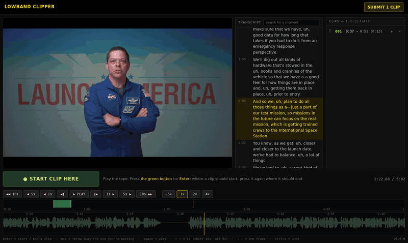
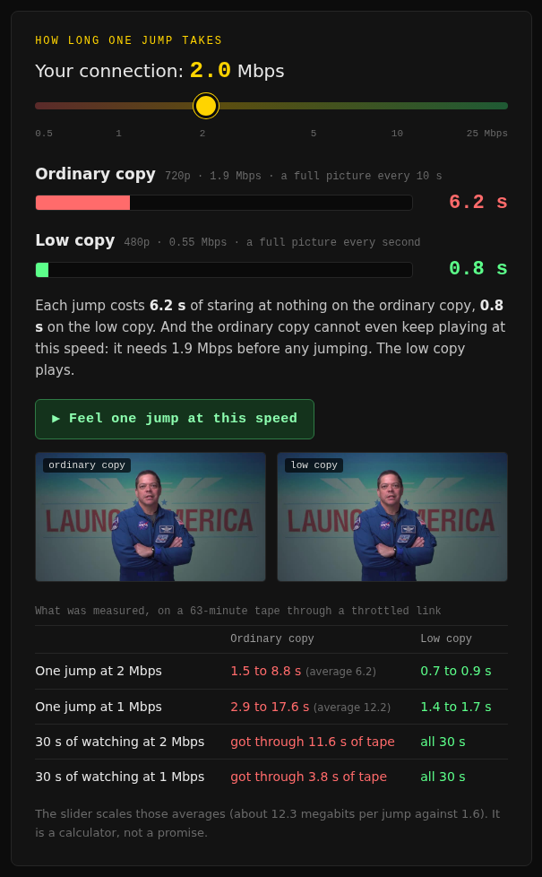
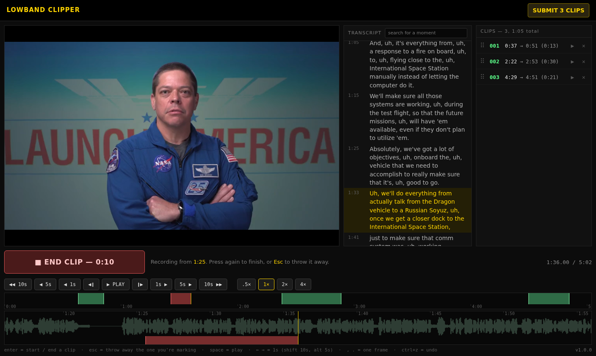
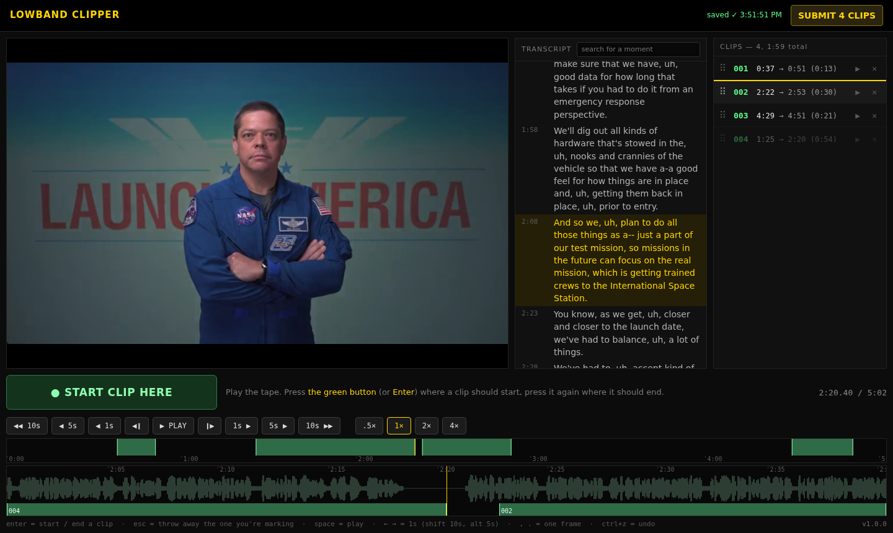
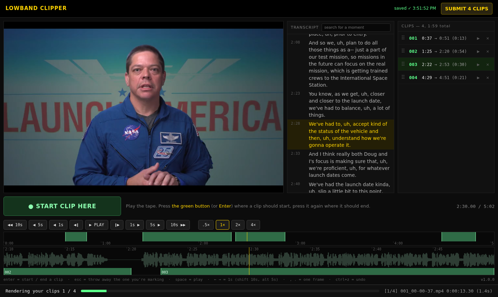

# lowband-clipper

**Cut clips out of hour-long tapes when the connection can't carry them.**

Watch a small copy of the tape in your browser. Press one button where a clip starts and again where it ends. The cutting happens back where the tape lives, from the full-quality file.

### [▶ Try the live editor in your browser](https://pingywon.github.io/lowband-clipper/)

Nothing to install: mark clips, drag them into a new order, scrub the timeline. Current release: <!-- version -->**v1.0.1**<!-- /version -->



## Why: not enough bandwidth

This started with a documentary: a stack of interviews, each one a single take about an hour long, sitting on a machine at home. The job was to watch them and pull out the good moments, often from somewhere else.

The connection could not carry it. Every jump along the timeline had to download megabytes before a picture appeared, and plain playback kept freezing. A normal video editor needs the whole file in front of it, and that was never going to arrive.

Two small things fixed it:

- **A low copy of each tape.** 480p, about half a megabit per second, and **a full picture every second**. A browser can only start showing video at a full picture (a keyframe). With one every ten seconds, each jump drags in up to ten seconds of video first. With one every second it drags in almost nothing.
- **An editor that asks for nothing.** No project, no tracks, no timeline to manage. You watch, you press one button twice, the clip is on the list. The server cuts the real files.

Measured on a 63-minute tape, through a link throttled to each speed:

| | Ordinary copy<br><sub>720p · 1.9 Mbps · keyframe every 10 s</sub> | Low copy<br><sub>480p · 0.55 Mbps · keyframe every second</sub> |
|---|---|---|
| One jump at 2 Mbps | 1.5 to 8.8 s (average 6.2) | 0.7 to 0.9 s |
| One jump at 1 Mbps | 2.9 to 17.6 s (average 12.2) | 1.4 to 1.7 s |
| 30 s of watching at 2 Mbps | got through 11.6 s of tape | all 30 s |
| 30 s of watching at 1 Mbps | got through 3.8 s of tape | all 30 s |

[](https://pingywon.github.io/lowband-clipper/#why)

The [project page](https://pingywon.github.io/lowband-clipper/#why) has this as a slider you can drag.

## How it works

**1. Watch and mark.** Play the tape. Press the green button (or <kbd>Enter</kbd>) where a clip should start. It turns red and counts. Press it again where the clip should end.



**2. Your clips, in your order.** Each clip lands in a numbered list. Drag one to reorder, ▶ plays just that clip, ✕ drops it, <kbd>Ctrl</kbd>+<kbd>Z</kbd> undoes. Clips can overlap and be any length.



**3. Submit.** The server cuts every clip out of the full-quality tape with ffmpeg, as numbered files plus a plain-text list of what each one is. The low copy is only ever for watching.



## Run it

You need Python 3.9 or newer and `ffmpeg` / `ffprobe` on the PATH. There is nothing to install.

```sh
git clone https://github.com/pingywon/lowband-clipper
cd lowband-clipper

# once per tape: make its small viewing copy
python3 clipper.py low ~/tapes/interview.mp4

# serve the folder, then open http://127.0.0.1:8765/
python3 clipper.py ~/tapes
```

Any video file in the folder is a tape. Everything the tool writes stays beside it:

```
~/tapes/
  interview.mp4            your tape; clips are cut from this
  interview.low.mp4        the viewing copy (clipper.py low)
  interview.srt            optional transcript: .srt, .vtt or .json, same name as the tape
  interview-clips/         001_00-04-12.mp4, 002_..., README.txt
  .clipper/interview/      cut list, undo history, dated backups, cached waveform
```

A transcript becomes a panel you can search and click to jump. In a `.json` transcript (`[{"start": 12.5, "end": 15.0, "text": "..."}]`), `"role": "q"` marks an interviewer's line and shows it dimmed.

### From another computer

By default the editor listens on the computer it runs on and nowhere else. To reach it from another machine:

```sh
python3 clipper.py ~/tapes --bind 0.0.0.0
```

**There is no login.** Anyone who can reach that port can watch the tapes and cut clips, so only do this on a network you trust. The server does refuse commands that another website tries to send through your browser.

### Keys

| Key | Does |
|---|---|
| <kbd>Enter</kbd> | start a clip, then end it |
| <kbd>Esc</kbd> | throw away the clip you are marking |
| <kbd>Space</kbd> | play / pause |
| <kbd>←</kbd> <kbd>→</kbd> | 1 second (<kbd>Shift</kbd> 10 s, <kbd>Alt</kbd> 5 s) |
| <kbd>,</kbd> <kbd>.</kbd> | one frame |
| <kbd>Ctrl</kbd>+<kbd>Z</kbd> | undo (<kbd>Shift</kbd> to redo) |

### Without the browser

```sh
python3 clipper.py render ~/tapes interview            # cut the marked clips
python3 clipper.py render ~/tapes interview --dry      # just print the ffmpeg lines
python3 clipper.py render ~/tapes interview --only 3,7
```

## Working on it

```sh
python3 -m unittest discover -s tests   # the rules, the server, real renders, and the pages in headless Chromium
node --test                             # the same rules in JavaScript, from the same test cases
python3 tools/build_site.py             # rebuild the project page in docs/
python3 tools/preview.py                # look at it locally, the way GitHub Pages serves it
python3 tools/shots.py                  # retake the pictures in this README
```

The live demo is the real editor from `web/`. Only the server is swapped out, for `web/backend-demo.js`, which keeps the cut list in the browser and pretends to render. The cut-list rules exist twice, in `clipkit/model.py` and `web/model.js`, and `tests/vectors.json` runs the same cases through both.

Developed on Linux with Python 3.13. Not yet tried on Windows.

## Credits and licence

The code is under the [MIT licence](LICENSE).

The stand-in tape in the demo and the pictures is NASA footage, not covered by that licence. See [CREDITS.md](CREDITS.md). NASA does not endorse this project.
